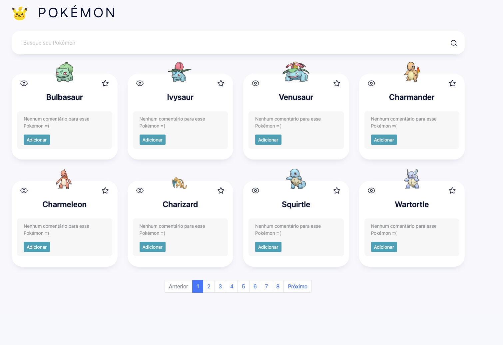

<h1 align="center">
  Angular Pokémon
</h1>

### Para ver o projeto rodando acesse: https://angular-pokemon-six.vercel.app/



## Sobre o projeto

O projeto criado com o objetivo de listar os principais Pokémons
O desafio inclui:

- Listar Pokémons
- Pesquisar pelo nome
- Marcar um Pokémon como favorito
- Adicionar comentários ao Pokémon


## Tecnologias usadas:

- `Angular v17`
- `RxJs`
- `NgRx`

## Como executar o projeto

### Instalar dependências do projeto
Executar os comandos abaixo.

```sh
cd angular.pokemon
npm install
```

### Executar o projeto
Executar os comandos abaixo.

```sh
npm run start
```

### Rodar os testes
Executar os comandos abaixo.

```sh
npm run test:coverage
```

### Acessar o projeto
Acesse o projeto através do endereço:
```sh
http://localhost:4200
```
